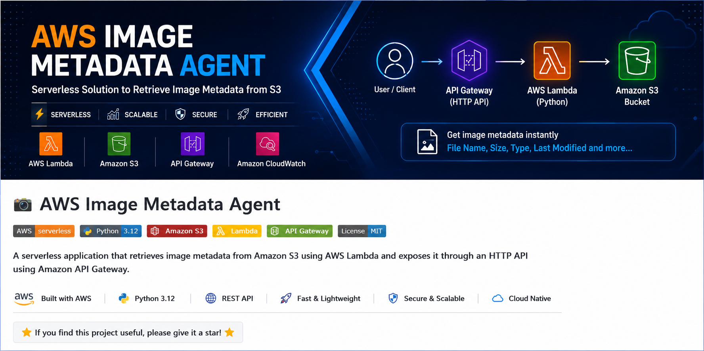

<p align="center">
  
</p>

# 📸 AWS Image Metadata Agent


## 🚀 Project Overview

The **AWS Image Metadata Agent** is a serverless application that retrieves metadata of an image stored in Amazon S3 using AWS Lambda and exposes it through an HTTP API using Amazon API Gateway.

The application returns image details such as:

- File Name
- File Size
- Extension
- Content Type
- Last Modified Date

---

# 🏗️ Architecture

```
               User
                 │
                 ▼
        API Gateway (HTTP API)
                 │
                 ▼
        AWS Lambda (Python)
                 │
        boto3.head_object()
                 │
                 ▼
           Amazon S3 Bucket
                 │
                 ▼
          Image Metadata
                 │
                 ▼
            JSON Response
```

---


# ☁️ AWS Services Used

- IAM
- Amazon S3
- AWS Lambda
- API Gateway
- CloudWatch

---

# 💻 Tech Stack

- Python 3.12
- boto3
- AWS Lambda
- Amazon S3
- API Gateway
- JSON

---

# 📂 Workflow

1. Upload image to Amazon S3
2. API Gateway receives request
3. Lambda function is triggered
4. Lambda reads object metadata using boto3
5. Metadata is returned as JSON

---

# 📤 Sample API Request

```
GET /metadata?bucket=image-metadata-agent-12345&key=a.png.webp
```

---

# 📥 Sample Response

```json
{
  "File": "a.png.webp",
  "Size": 246726,
  "Extension": "webp",
  "ContentType": "image/webp",
  "LastModified": "2026-07-20 08:26:23+00:00"
}
```

---

# 📁 Project Structure

```
ImageMetadataAgent/
│
├── lambda_function.py
├── requirements.txt
├── README.md
├── architecture.png
└── screenshots/
```

---

# ⚙️ Installation

Clone the repository

```bash
git clone https://github.com/sr913929-code/aws-image-metadata-agent.git
```

Move into project

```bash
cd aws-image-metadata-agent
```

Deploy Lambda function to AWS.

Configure:

- IAM Role
- S3 Bucket
- API Gateway

Test using:

```
/metadata?bucket=image-metadata-agent-12345&key=a.png.webp
```

---

# 📸 Screenshots

## Amazon S3

> Add screenshot here

## Lambda

> Add screenshot here

## API Gateway

> Add screenshot here

## Output

> Add screenshot here

---

# 🎯 Features

- Serverless Architecture
- REST API
- Reads S3 Object Metadata
- Fast Response
- Secure IAM Role
- CloudWatch Logging
- Easy Deployment

---

# 📚 Skills Demonstrated

- AWS IAM
- Amazon S3
- AWS Lambda
- API Gateway
- Python
- boto3
- REST API
- Serverless Computing

---

# 🚀 Future Improvements

- Upload Image API
- Image Dimension Detection
- Image Thumbnail Generator
- Face Detection
- Rekognition Integration
- DynamoDB Logging

---

# 👨‍💻 Author

**Sanjay Kumar**

- GitHub: https://github.com/sr913929-code
- LinkedIn: https://www.linkedin.com/in/sanjay-kumar-648a25348

---

⭐ If you found this project useful, don't forget to star the repository.
